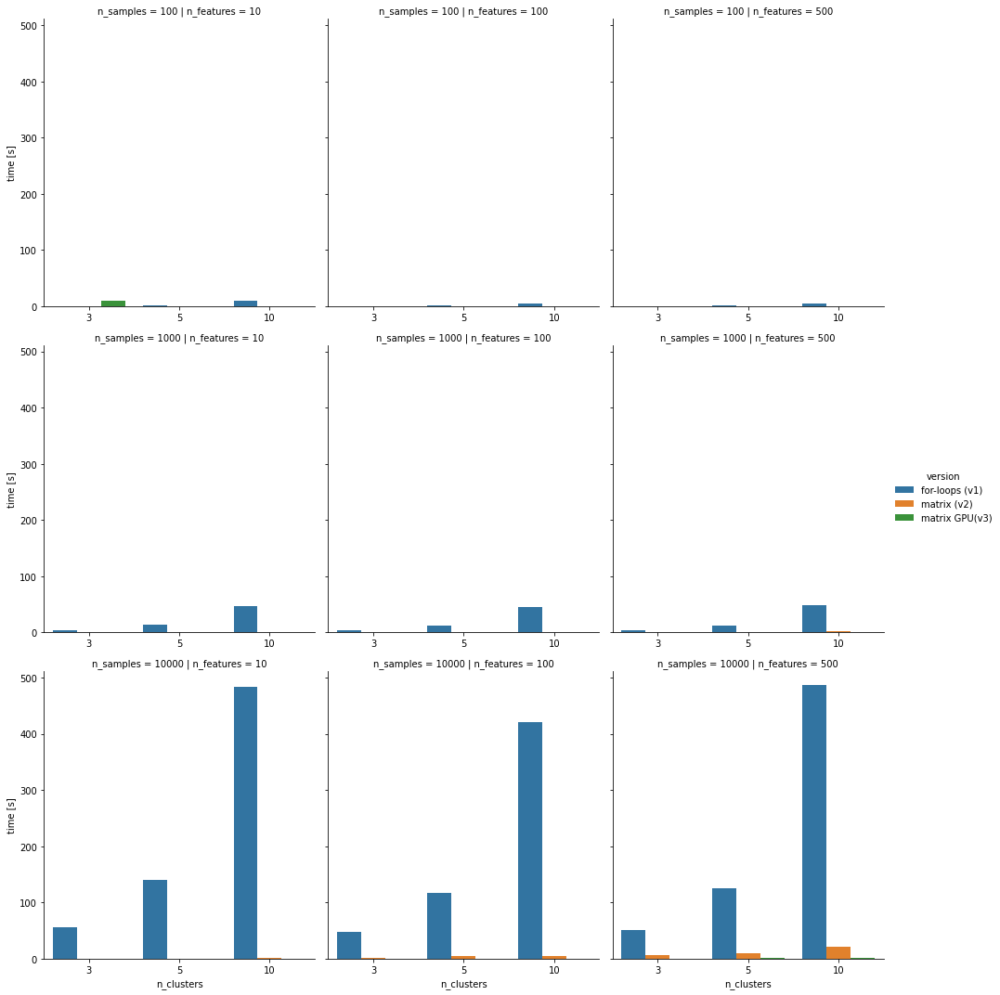
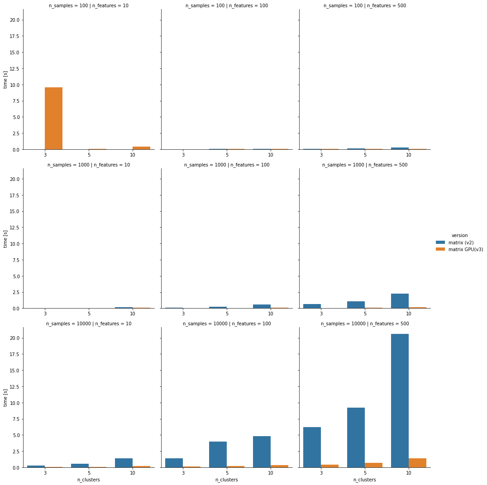
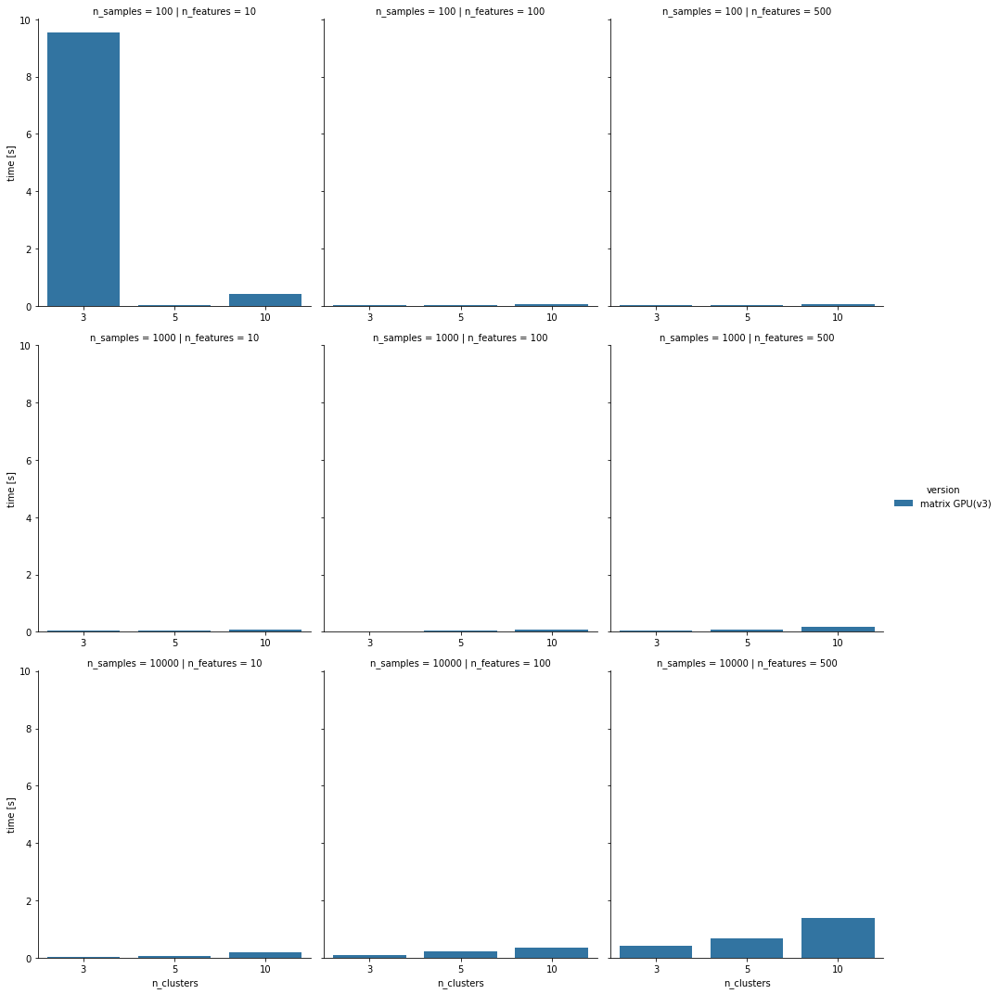
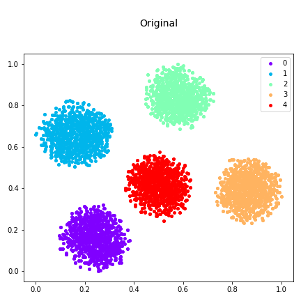
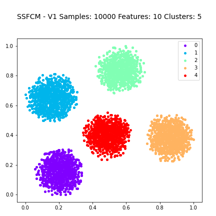
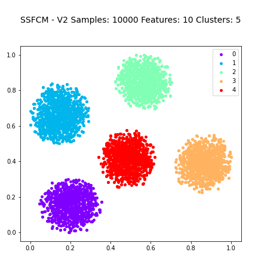
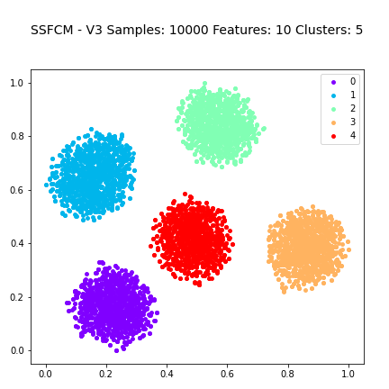

# Semi-SupervisedFuzzyC-Means

This is an implementation of Semi-Supervised Fuzzy C-Means (SSFCM) algorithm.
It has been developed three different version of the SSFCM algorithm:
* For-loop
* Matrix multiplication
* Matrix multiplication with GPU accellerator

Both the quality of the clustering results and the running time execution has being compared.

# Built With
* Python 3.9


# Getting Started
## Prerequisites
These are the libraries/packages that must be install within your python environment:
| Package | Min-Version |
| :----- | :- |
| Numpy |1.22.3|
| Scipy | 1.8|
| Cupy | 10.3.1|
| Matplotlib| 3.5.1|
| Pandas | 1.4.2|
| Seaborn | 0.11.2|
| Shutil | - |


## Usage
To perform the experiments locally it is necessary to have a GPU (with CUDA installed) or it could be used a Colab runtime with the hardware accelleration 

### Locally
```sh
$ python Semi-SupervisedFuzzyC-Means/main.py
```
### Google Colab

Using the notebook file available at the following link:

```sh
scrivere quì
```
## Results
### Comparison among all 3 algorithms

### Comparison among matrix multiplication version with and without GPU

### Running time matrix multiplication version with GPU


### Quality Assessment




